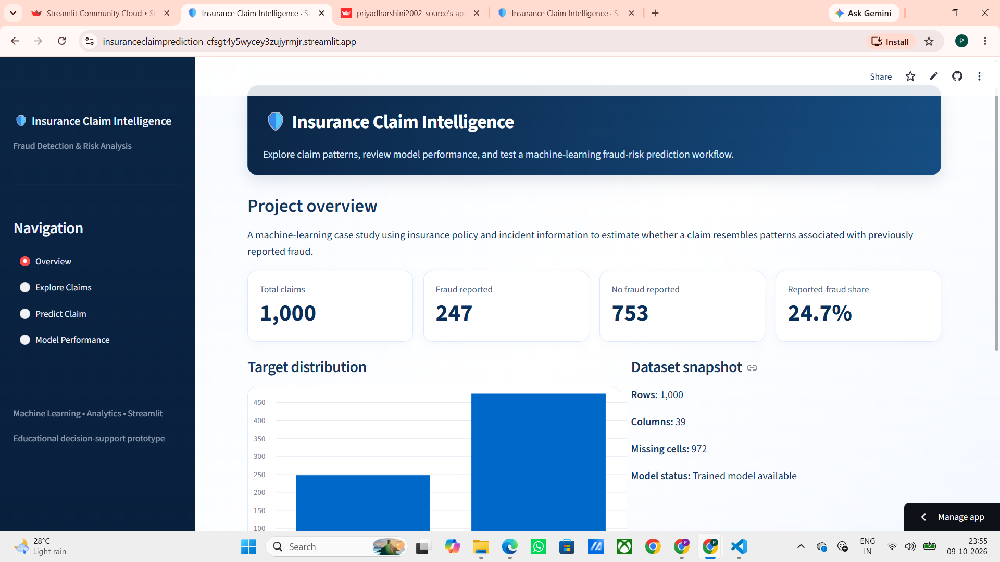
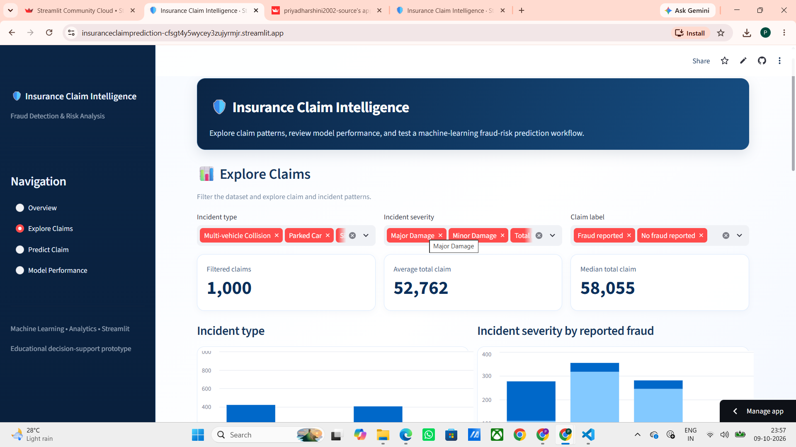
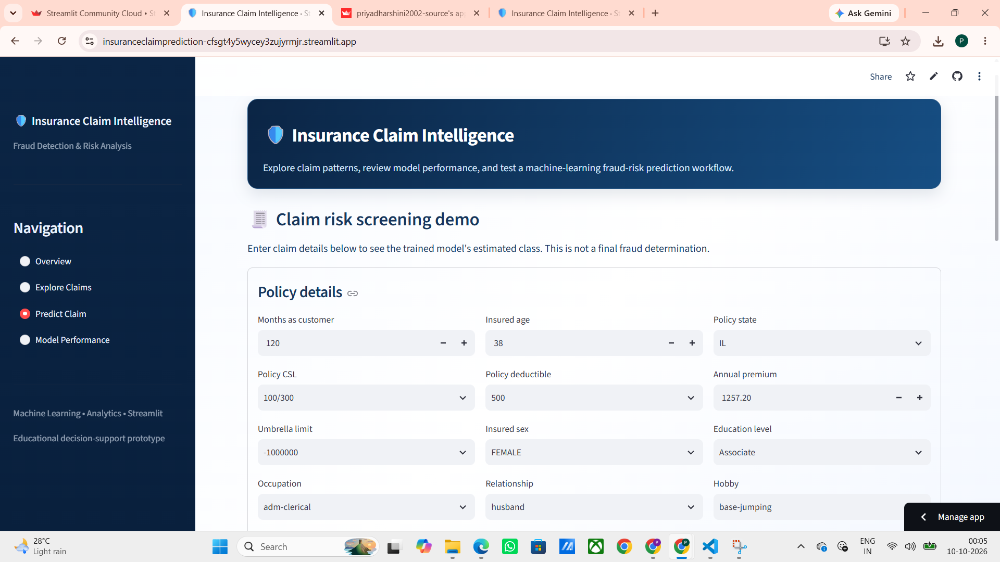
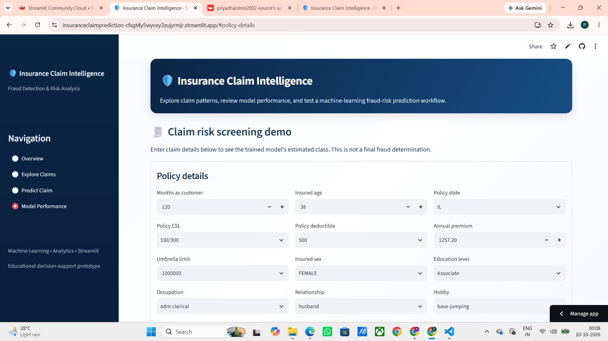
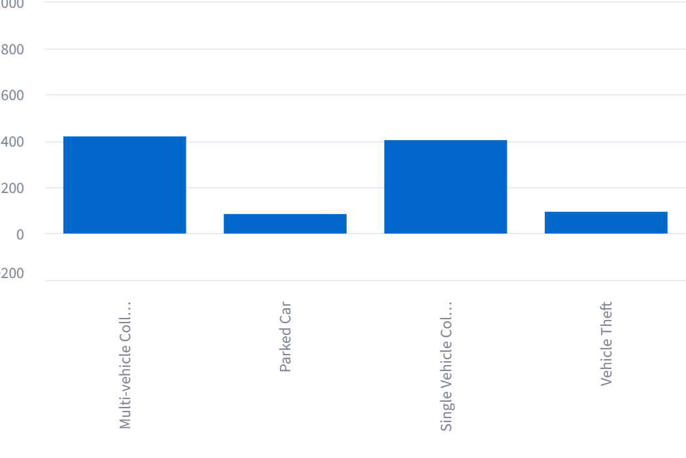
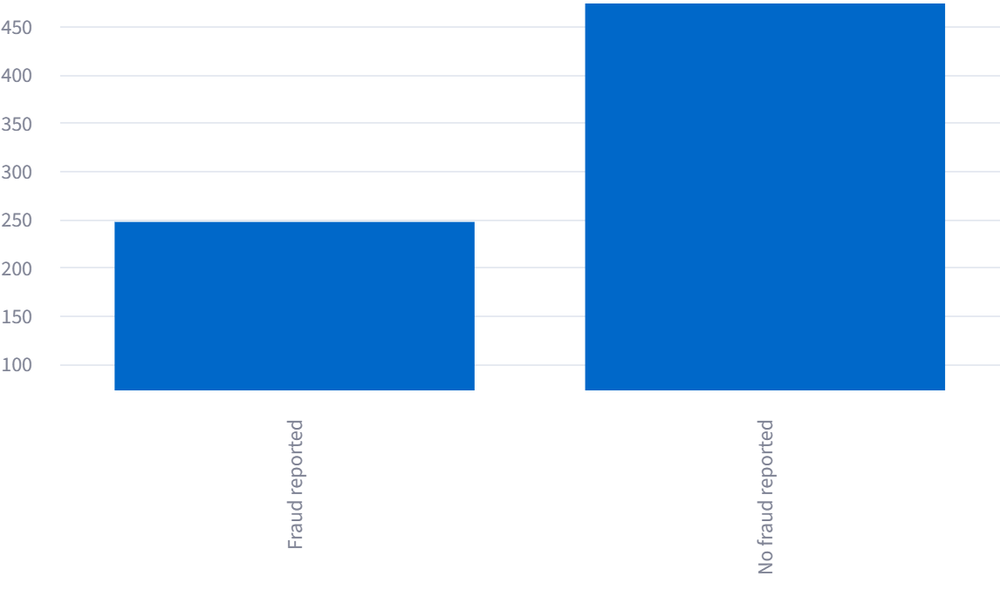
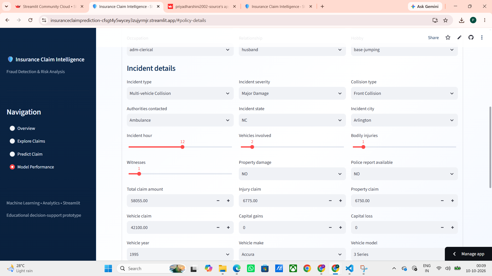
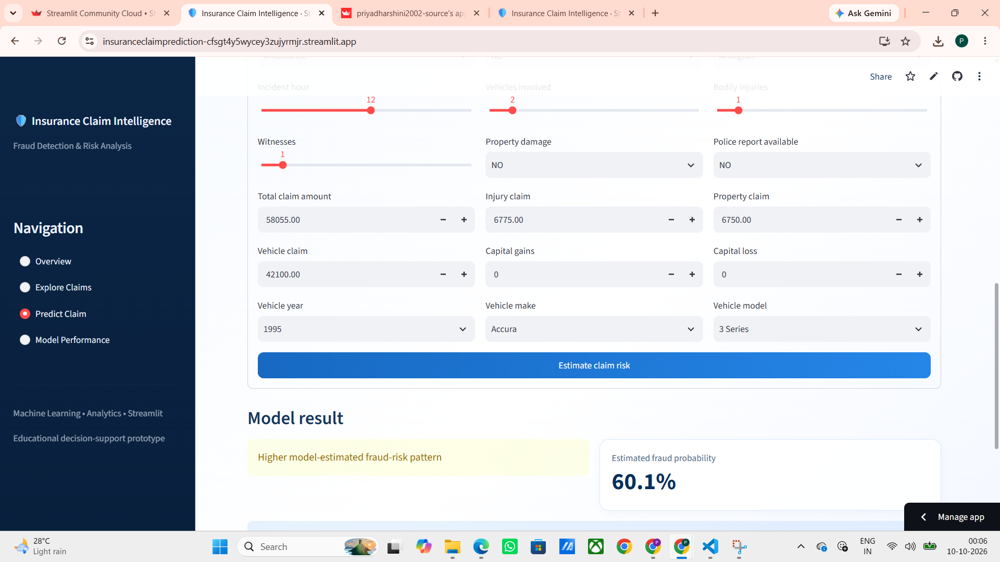

# 🛡️ Insurance Claim Intelligence
### Machine Learning-Based Insurance Fraud Detection & Risk Analysis

An interactive machine learning application built with **Python, Scikit-learn, and Streamlit** to explore insurance claims, analyze fraud patterns, estimate potential fraud risk, and evaluate machine learning model performance through a professional analytics dashboard.

[](https://www.python.org/)
[](https://streamlit.io/)
[](https://scikit-learn.org/)
[](https://pandas.pydata.org/)

---
## 🚀 Live Demo

Experience the **Insurance Claim Intelligence** application live:

[](https://insuranceclaimprediction-cfsgt4y5wycey3zujyrmjr.streamlit.app/)

🔗 **Live Application:** https://insuranceclaimprediction-cfsgt4y5wycey3zujyrmjr.streamlit.app/

Explore interactive insurance claim analytics, investigate reported-fraud patterns, generate model-based claim predictions, and review machine learning performance metrics.
## 📌 Project Overview

Insurance fraud can increase financial losses and complicate the claims assessment process. This project demonstrates how machine learning and interactive data visualization can support the analysis of insurance claims and identify patterns associated with reported fraud.

The application provides an integrated dashboard for exploring claim records, entering claim details for model-based predictions, and reviewing model evaluation metrics.

### 🎯 Objectives

- Analyze insurance claim characteristics and incident patterns.
- Explore claim amounts, incident types, and severity distributions.
- Predict whether a claim resembles the reported-fraud class learned from historical data.
- Compare machine learning models using standard evaluation metrics.
- Present analytical results through a user-friendly Streamlit interface.

---

## ✨ Key Features

- **Interactive Dashboard:** Summary statistics and insurance claim insights.
- **Explore Claims:** Filter claims by incident type, incident severity, and fraud label.
- **Claim Risk Prediction:** Enter claim details and receive a machine learning prediction.
- **Model Performance:** Review accuracy, precision, recall, F1-score, and model comparison results.
- **Data Visualization:** Charts for claim amount distributions, incident categories, and reported fraud patterns.
- **Filtered Data Export:** Download filtered claim records as a CSV file.
- **Professional Interface:** Organized navigation, clear KPI cards, and consistent styling.

---

## 🖥️ Application Screenshots

### 1. Overview Dashboard



The overview page presents key claim statistics and visual summaries to support an initial understanding of the dataset.

### 2. Explore Claims



Explore claim records using interactive filters and examine incident patterns and claim amount statistics.

### 3. Predict Claim



Enter claim characteristics to obtain a prediction from the trained machine learning pipeline.

### 4. Model Performance



Review model evaluation metrics and compare the performance of the candidate algorithms.

### 5. Incident Types



Visualize the distribution of different incident categories in the dataset.

### 6. Incident Severity and Reported Fraud


Analyze the relationship between incident severity and the reported-fraud label.

### 7. Claim Amount Distribution


Examine the distribution of insurance claim amounts to understand claim-value patterns.

### 8. Target Distribution



Understand the distribution of the target variable and the balance between reported-fraud and non-fraud records.

### 9. Incident Details



Inspect additional incident-related information available in the dashboard.

### 10. Claim Risk Estimate



View the claim risk estimation interface and its prediction output.

---

## 🧠 Machine Learning Approach

The project evaluates two supervised machine learning algorithms:

1. **Random Forest Classifier**
2. **Gradient Boosting Classifier**

The training pipeline includes:

- Handling missing values using imputation.
- Encoding categorical features.
- Transforming numerical and categorical data using a preprocessing pipeline.
- Splitting data into training and testing sets.
- Evaluating candidate models on held-out test data.
- Selecting the model based on test-set F1-score.

The selected model and evaluation metrics are saved for use in the Streamlit application.

### 📊 Model Evaluation Results

The following metrics were recorded during the local test run:

| Metric | Random Forest | Gradient Boosting |
|---|---:|---:|
| Accuracy | 80.40% | 80.80% |
| Precision | 62.26% | 60.94% |
| Recall | 53.23% | 62.90% |
| F1-score | 57.39% | 61.90% |

**Selected model:** Gradient Boosting Classifier, based on the higher test-set F1-score.

*Note: These are results from one local train/test split. They do not guarantee performance on unseen real-world insurance claims.*

---

## 🗂️ Project Structure

```text
INSURANCE_CLAIM_PREDICTION/
│
├── app.py
├── train_model.py
├── requirements.txt
├── README.md
├── .gitignore
│
├── data/
│   └── insurance_claims.xlsx
│
├── models/
│   ├── insurance_fraud_model.joblib
│   ├── metrics.json
│   └── README.txt
│
└── screenshots/
    ├── overview.png
    ├── explore_claims.png
    ├── predict_claim.png
    ├── model_performance.png
    ├── incident_types.png
    ├── target_distribution.png
    ├── incident_details.png
    ├── estimate_claim_risk.png
    ├── Claim amount distribution.png
    └── Incident severity by reported fraud.png
```

---

## ⚙️ Technologies Used

| Technology | Purpose |
|---|---|
| Python | Application development |
| Streamlit | Interactive web application |
| Pandas | Data manipulation and analysis |
| NumPy | Numerical computing |
| Scikit-learn | Machine learning and preprocessing |
| Joblib | Model serialization and loading |
| Matplotlib | Data visualization |
| Seaborn | Statistical visualization |
| OpenPyXL | Excel dataset support |

---

## 🚀 Installation and Setup

### Prerequisites

- Python 3.12
- pip package manager
- Git (optional, for cloning the repository)

### 1. Clone the Repository

```bash
git clone https://github.com/priyadharshini2002-source/INSURANCE_CLAIM_PREDICTION.git
```

### 2. Navigate to the Project Directory

```bash
cd INSURANCE_CLAIM_PREDICTION
```

If the application files are inside an inner `INSURANCE_CLAIM_PREDICTION` directory, navigate into that directory before running the commands below.

### 3. Install Dependencies

```bash
py -3.12 -m pip install -r requirements.txt
```

Use a compatible scikit-learn version when loading the saved model. The current model was successfully loaded locally using scikit-learn 1.8.0.

### 4. Run the Application

```bash
py -3.12 -m streamlit run app.py
```

### 5. Open in Your Browser

Visit:

```text
http://localhost:8501
```

---

## 🔄 Retrain the Model

To train the candidate models again and save the selected model:

```bash
py -3.12 train_model.py
```

The script saves the trained model to `models/insurance_fraud_model.joblib` and evaluation metrics to `models/metrics.json`.

Ensure that the dataset is available at the path expected by `train_model.py`.

---

## ☁️ Deployment

This application can be deployed using Streamlit Community Cloud.

1. Push the project files to GitHub.
2. Open [Streamlit Community Cloud](https://share.streamlit.io/).
3. Create a new app and connect your GitHub repository.
4. Select the correct branch.
5. Set the main file path to `app.py` or `INSURANCE_CLAIM_PREDICTION/app.py`, depending on your repository structure.
6. Confirm the required dependencies and compatible Python version.
7. Deploy the application.

**Important:** Ensure that the selected model file, `requirements.txt`, and dataset paths match the repository structure. Test the deployed app after deployment.

### Live Demo

Add your deployed Streamlit URL here once it is working:

`https://your-streamlit-app-url`

---

## 🔐 Responsible Use and Limitations

- This project is intended for educational and analytical demonstration.
- A prediction represents a model estimate based on patterns learned from the training data; it does not establish that fraud has occurred.
- Model performance can be affected by class imbalance, data quality, and differences between training data and real-world claims.
- Predictions should not be used as the sole basis for rejecting, delaying, or denying insurance claims.
- Any real-world application requires validation, fairness assessment, privacy safeguards, and qualified human review.

---

## 🔮 Future Enhancements

- Add explainability with SHAP or feature importance visualizations.
- Evaluate models using cross-validation and precision-recall curves.
- Improve prediction calibration and threshold selection.
- Add automated data-quality checks.
- Introduce secure database integration and audit logging.
- Enhance accessibility and responsive dashboard design.

---

## 👩‍💻 Author

**Priyadharshini S.**

MSc Data Science | Machine Learning | Data Analytics

GitHub: [@priyadharshini2002-source](https://github.com/priyadharshini2002-source)

---

## ⭐ Acknowledgements

This project was developed as a machine learning and data analytics application to demonstrate insurance claim exploration, reported-fraud prediction, and model evaluation.

If you find this project useful, consider giving the repository a ⭐ on GitHub.
